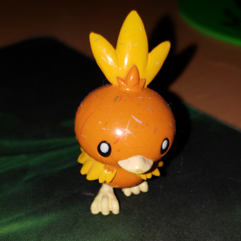
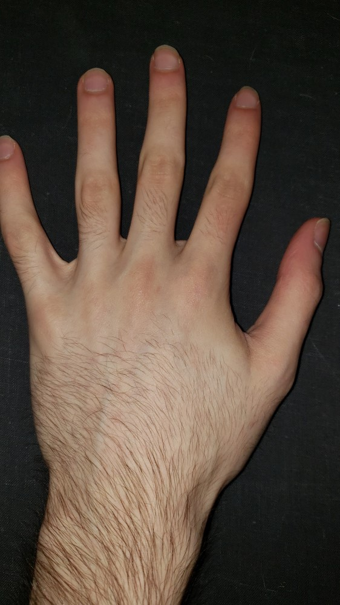
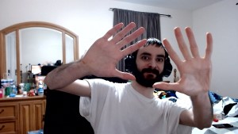
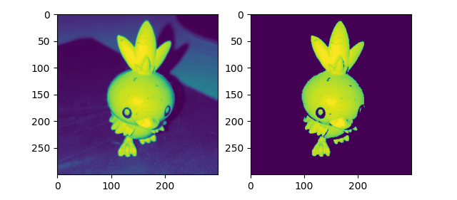
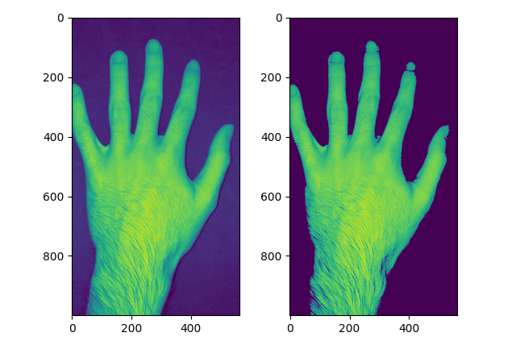
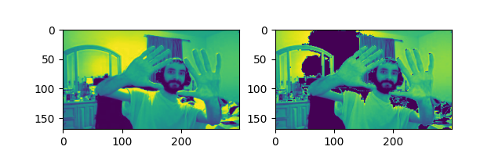

# Image-Segmentation
## Disclaimer
_I do not suggest using this code because I still need to make some improvements on it; my code is messy and most likely does not work properly. I had to program this in a day and deal with a time constraint._
## Input Images

## Output Images

